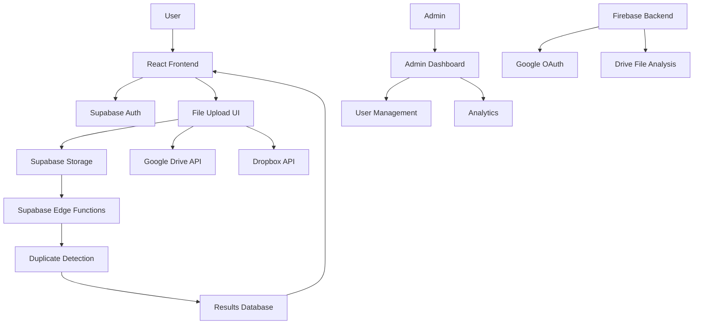

# 🔍 Fullstack Code Review Prompt for GitHub Copilot

## 🎯 Goal

This is a **production-ready fullstack duplicate photo detection app** that supports:

- 🔐 **Supabase authentication** with Google & Email (pix-dupe-detect-main)
- 🔥 **Firebase integration** with Google Drive API (Dtddpe-ryan-main)  
- 🛡️ **Role-based access control** (admin/user)
- 📤 **Secure file uploads** from:
  - Local computer
  - Google Drive (via OAuth Picker)
  - Dropbox (via Dropbox Chooser)
- 🧠 **File duplication detection** with backend algorithms + cloud storage
- 🔁 **Full session management** with inactivity timeout
- ✅ **End-to-end flow** for admins and users
- ⚙️ **Integration** with Supabase functions, storage, and RLS

---

## ✅ Project Structure

```
duplicate-photo/
├── pix-dupe-detect-main/           # 🚀 Supabase + React (Primary App)
│   ├── src/
│   │   ├── components/             # Upload UIs, CloudIntegration
│   │   ├── hooks/                  # useAuth, useSessionTimeout, useSecurity
│   │   ├── integrations/supabase/  # Supabase Client Config
│   │   ├── pages/                  # React Pages (SignIn, Admin, Upload)
│   │   └── lib/                    # Utilities
│   ├── supabase/                   # Functions, SQL, RLS policies
│   ├── package.json                # Vite + React + TypeScript + Supabase
│   └── .env.example               # ENV template
│
├── Dtddpe-ryan-main/              # 🔥 Firebase + FastAPI Backend
│   ├── frontend/                   # React frontend
│   ├── backend/                    # FastAPI with Firebase integration
│   ├── functions/                  # Firebase Cloud Functions
│   ├── firebase.json              # Firebase config
│   └── package.json               # Firebase dependencies
│
└── backend/                       # 🐍 Legacy Python FastAPI
    ├── clean_google_drive_backend.py
    ├── requirements.txt
    └── firebase_service.py
```

---

## 🧪 What Copilot Should Validate (Suggestions for Review)

### ✅ FRONTEND ↔ BACKEND CONNECTIONS

**Supabase App (pix-dupe-detect-main):**
- [ ] `src/integrations/supabase/client.ts` properly connects to Supabase (check env vars)
- [ ] `src/hooks/useAuth.ts` manages session, login, logout
- [ ] Upload components trigger file upload to Supabase Storage via `supabase.storage.from('uploads')`
- [ ] `src/hooks/useSecurity.ts` triggers backend duplicate detection via `supabase.functions.invoke('detect_duplicates')`
- [ ] Toasts / status are shown for success/error
- [ ] Result UI pulls from `duplicate_checks` or `dedup_events` tables

**Firebase App (Dtddpe-ryan-main):**
- [ ] `backend/firebase_service.py` connects to Firebase with service account
- [ ] FastAPI backend at `/backend/clean_google_drive_backend.py` handles Google OAuth
- [ ] Frontend connects to FastAPI endpoints for file operations
- [ ] Firebase functions handle cloud processing

### ✅ CLOUD STORAGE INTEGRATIONS

- [ ] **Google Picker** is correctly initialized with `NEXT_PUBLIC_GDRIVE_CLIENT_ID`
  - Consent screen opens
  - Token is passed to Picker
- [ ] **Dropbox Chooser** loads with valid `NEXT_PUBLIC_DROPBOX_APP_KEY`
  - File selection works
  - Files are sent to Supabase/Firebase
- [ ] **Local uploads** work via drag-and-drop or file picker

### ✅ AUTH & SESSION SECURITY

**Supabase (Primary):**
- [ ] SignIn redirects `admin` to `/admin`, users to `/upload`
- [ ] `src/hooks/useSessionTimeout.ts` detects inactivity and signs out after 30 min
- [ ] Session is preserved across refresh
- [ ] Supabase `auth.user()` is used in API calls
- [ ] Role is checked before showing `/admin`

**Firebase (Secondary):**
- [ ] Google OAuth flow works via `/google/login` → `/google/callback`
- [ ] Firebase Auth tokens are validated in backend
- [ ] User sessions stored in Firebase Firestore

### ✅ RLS POLICIES & DB FUNCTIONS

**Supabase:**
- [ ] SQL policies prevent anonymous access
- [ ] All policies use `auth.uid() IS NOT NULL` or `has_role()`
- [ ] `detect_duplicates` function is callable by the frontend
- [ ] Row Level Security (RLS) enabled on all tables

**Firebase:**
- [ ] Firestore security rules restrict access to authenticated users
- [ ] Cloud Functions have proper authentication

### ✅ BACKEND ANALYSIS

**Supabase Edge Functions:**
- [ ] Functions deployed and accessible
- [ ] Proper error handling and logging
- [ ] Integration with external APIs (rclone, duplicate detection)

**FastAPI Backend:**
- [ ] `backend/clean_google_drive_backend.py` starts with `uvicorn`
- [ ] Google Drive API integration works
- [ ] File analysis and duplicate detection functional
- [ ] Results stored in SQLite or Firebase

---

## 📂 ENV Variables (Supabase, Firebase, Drive, Dropbox, etc.)

**For Supabase App (pix-dupe-detect-main):**
```env
# Supabase Configuration
NEXT_PUBLIC_SUPABASE_URL=https://your-project.supabase.co
NEXT_PUBLIC_SUPABASE_ANON_KEY=your-anon-key
SUPABASE_SERVICE_ROLE_KEY=your-service-role-key

# Cloud Storage APIs
NEXT_PUBLIC_GDRIVE_CLIENT_ID=your-google-client-id
GDRIVE_CLIENT_SECRET=your-google-client-secret

NEXT_PUBLIC_DROPBOX_APP_KEY=your-dropbox-app-key

# Security
RECAPTCHA_SITE_KEY=your-recaptcha-site-key
RECAPTCHA_SECRET_KEY=your-recaptcha-secret-key
```

**For Firebase App (Dtddpe-ryan-main):**
```env
# Firebase Configuration
FIREBASE_PROJECT_ID=your-firebase-project-id
FIREBASE_PRIVATE_KEY_PATH=./firebase-service-account-key.json

# Google OAuth Configuration
GOOGLE_CLIENT_ID=your-google-client-id
GOOGLE_CLIENT_SECRET=your-google-client-secret
GOOGLE_REDIRECT_URI=http://localhost:8010/google/callback
```

---

## ✅ Suggested Actions in Codespaces

> For Copilot, developer, or DevOps engineer:

### 🚀 **Primary Supabase App:**
```bash
cd pix-dupe-detect-main
npm install && npm run dev
# Opens on http://localhost:5173
```

### 🔥 **Firebase Backend:**
```bash
cd Dtddpe-ryan-main/backend
pip install -r requirements.txt
uvicorn clean_google_drive_backend:app --host 0.0.0.0 --port 8010
# Opens on http://localhost:8010
```

### 🧪 **Testing Checklist:**
1. Create `.env.local` files from `.env.example`
2. Test:
   - Local file upload ✅
   - Google Drive + Dropbox upload ✅
   - Admin dashboard ✅
   - User authentication flow ✅
3. Validate Supabase functions: `detect_duplicates`, `security-manager`
4. Check Firebase integration (if using secondary app)
5. Inspect any edge function logic or API routes

---

## 🧠 Final Review Notes

- **Focus on file flow**: `source ➝ Supabase/Firebase ➝ analysis ➝ UI`
- **Ensure auth is secure**: users routed properly, sessions managed
- **Confirm cloud integrations**: work with their SDKs (Google Picker, Dropbox)
- **Validate deduplication**: trigger returns correct data, results displayed
- **Check performance**: large file handling, progress indicators
- **Security audit**: RLS policies, input validation, rate limiting

---

## 🎯 Quick Start Commands

```bash
# Install all dependencies
npm run install:all

# Start primary Supabase app
npm run dev:supabase

# Start Firebase backend (optional)
npm run dev:firebase

# Run tests
npm run test:all

# Build for production
npm run build:all
```

---

## 🔧 Architecture Overview



Let me know if you'd like me to focus on any specific part of the architecture or create additional setup scripts! 🚀
