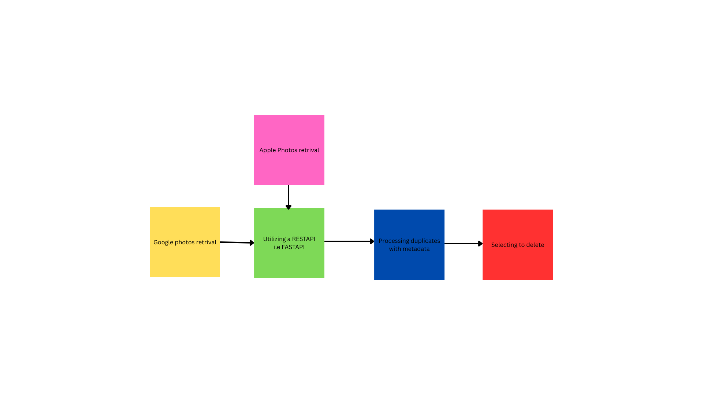

# Reading Duplicate or similar based on threshold

The open source metadata reader I found was 

https://pypi.org/project/exif/

The idea is if the threshold is reached, then every other duplicate photo that is within the threshhold besides the base photo to be deleted.

# What the API is looking for

For the method of hashing the metadata, we are using the perceptual hash, utilizing the similar photo structure. Because the photos aren't encrypted, we are going to assume that most of the pictures have similar metrics that can be quantified with a vector matricie.

# High Level Design 
The workflow of the project is as followed

<<<<<<< HEAD

=======
>>>>>>> 08d713e (Updated the readme for utilzation of API in use)

# Work in progress
Currently working on
* Utilizing restful API to integrate with apple photos and google photos. Specifically with FastAPI
* create seperate .py files for instances of google photos and apple photos
* research other open source API's to see instances of faster retrival of metadata to cut down on computational costs
* figuring out the base threshold that the perception can use for the "similarity score"
